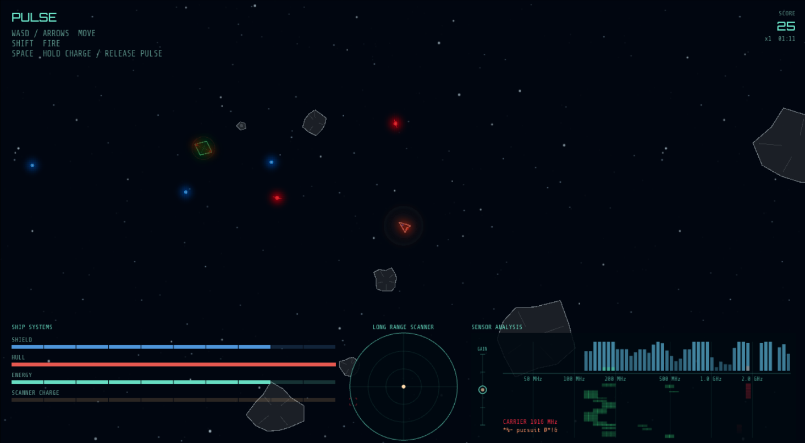

# Pulse - Ludum Dare Compo #59 Entry

**Theme:** Signal  
**Engine:** Phaser 3, vanilla JavaScript ES modules  
**Target:** Web browser / HTML5

`Pulse` is an atmospheric scanner-combat arcade game about fighting in the dark. Enemy ships are usually cloaked, so you survive by listening to their emissions, reading the sensor display, firing into likely positions, and choosing when to reveal the arena with a charged scanner pulse.



## Running Locally

This project uses ES modules and Phaser from a CDN, so serve it over HTTP instead of opening `index.html` with `file://`.

```bash
python3 -m http.server 8000
```

Then open <http://localhost:8000>.

Any equivalent static server works.

## Controls

- `A` / `D` or `Left` / `Right` - rotate
- `W` / `Up` - forward thrust
- `S` / `Down` - reverse thrust
- `Shift` - fire torpedo
- Hold `Space` - charge scanner pulse
- Release `Space` - emit scanner pulse
- `R` or `Enter` - restart after game over

The ship fires or thrusts in the direction it is facing. The world wraps at the edges.

The more charge you give to a scanner pulse, the farther it will travel. This will show you where more enemies are, but it will also let them know where you are.

## How To Play

Enemy ships cloak by default. They become directly visible when decloaking to attack, or for a brief instant when detected, but scanner pings leave fading bracket blips at the last known position instead of tracking targets live.

Use small pulses to check nearby space without waking up the whole arena. Use larger pulses when you need long-range information. Torpedoes also reveal a small area as they fly, so shooting into darkness can still give useful information.

Asteroids and meteoroids are always visible. Meteoroids pop on contact; asteroids bounce ships away. The player takes shield and hull damage from collisions and hostile fire.

## HUD

### Top Left

Shows the title and basic controls.

### Top Right

- `SCORE` - current score
- `xN` - current score multiplier
- `MM:SS` - survival time

The multiplier rises with kill streaks and resets when you take damage.

### Ship Systems

Bottom-left panel:

- `SHIELD` - blue segmented shield bar. Shields absorb most damage and visually glow around the ship.
- `HULL` - red hull bar. When this reaches zero, the ship breaks apart and the game ends.
- `ENERGY` - cyan weapon/scanner energy. Shots spend this pool; it recharges over time.
- `SCANNER CHARGE` - amber radar pulse capacitor. Hold `Space` to fill it, release to send the pulse.

Shields recharge faster when the main energy pool isn't recharging.

### Long Range Scanner

Bottom-center radar:

- The amber dot in the center is you.
- Expanding cyan rings are active scanner pulses.
- Green bracket blips mark the last known location of detected ships.
- Red/orange bracket blips mark intercepted comms sources.
- Blips fade over time and disappear when the ship itself is visible or destroyed.

The scanner range extends beyond the visible screen at high pulse power.

### Sensor Analysis

Bottom-right panel:

- Top bars show current signal strength by frequency.
- The waterfall below shows recent signal history over time.
- Grey/blue activity is the full effects mix: engine, shots, impacts, scanner pulses, comms, and other game sounds.
- Green signals are enemy EM signatures.
- Red signals indicate close or strong enemy contacts.
- Red/orange narrow spikes are intercepted comms bursts.
- The vertical `GAIN` slider adjusts effects volume and the display gain. Center is normal, up boosts, down attenuates.

Enemy signals are Doppler-shifted: approaching ships shift upward, receding ships shift downward. The spectrum tells you what kinds of signals are nearby; stereo audio helps tell you where they are.

## Enemies

- **Drifters** - slow, compact hexagonal ships with steady behavior.
- **Seekers** - faster hunters that curve into attack runs.
- **Bursts** - kamikaze dash ships with a pause-and-burst rhythm.

Enemies decloak to fire, then recloak after their attack window. They try to avoid rocks and each other.

## Audio

`Pulse` uses procedural Web Audio synthesis. Headphones help: enemy EM signatures pan by direction, scanner pings and echoes reveal contacts, comm bursts pollute the sensor display, and the ambient music responds to combat and critical damage.

## Game Over

When the ship is destroyed, it explodes into fragments and the overlay shows:

- `SIGNAL LOST`
- Final score
- Local high score table
- Restart prompt

High scores are stored locally in `localStorage`.
